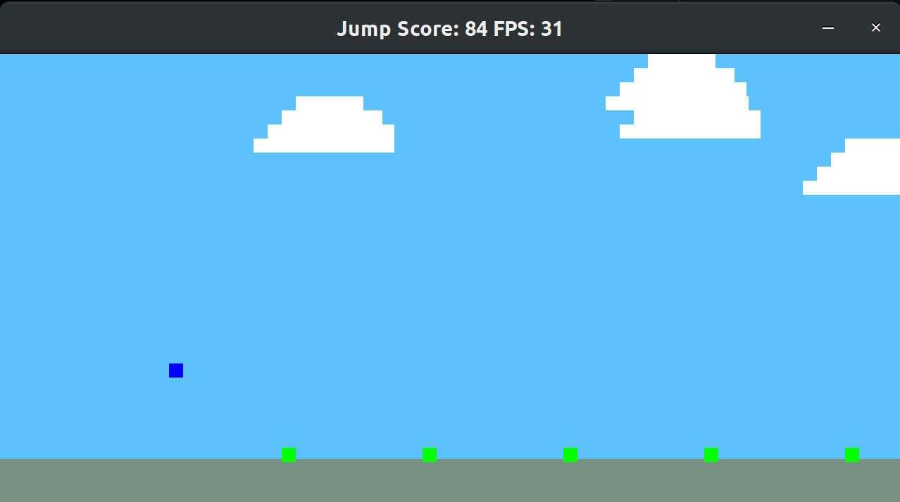

<!--
*** Thanks for checking out the Best-README-Template. If you have a suggestion
*** that would make this better, please fork the repo and create a pull request
*** or simply open an issue with the tag "enhancement".
*** Thanks again! Now go create something AMAZING! :D
***
***
***
*** To avoid retyping too much info. Do a search and replace for the following:
*** viciopoli01, Jump, twitter_handle, polivicio@gmail.com, Jump, Jump is the capstone project for the Udacity `
C++ Nanodegree Program` . In particular it is a game where you need to jump with yourself to avoid obstacles.
-->


<!-- PROJECT SHIELDS -->
<!--
*** I'm using markdown "reference style" links for readability.
*** Reference links are enclosed in brackets [ ] instead of parentheses ( ).
*** See the bottom of this document for the declaration of the reference variables
*** for contributors-url, forks-url, etc. This is an optional, concise syntax you may use.
*** https://www.markdownguide.org/basic-syntax/#reference-style-links
-->
[![Contributors][contributors-shield]][contributors-url]
[![Forks][forks-shield]][forks-url]
[![Stargazers][stars-shield]][stars-url]
[![Issues][issues-shield]][issues-url]
[![MIT License][license-shield]][license-url]
[![LinkedIn][linkedin-shield]][linkedin-url]


<!-- PROJECT LOGO -->
<br />
<p align="center">
  <a href="https://github.com/viciopoli01/Jump">
    
  </a>

  <h3 align="center">Jump</h3>

  <p align="center">
    Jump is the capstone project for the Udacity <a href="https://www.udacity.com/course/c-plus-plus-nanodegree--nd213">C++ Nanodegree Program</a> . In particular, it is a game where you need to jump with yourself to avoid obstacles. It uses the camera of your laptop to detect the movements. Check it out!
    <br />
    <br />
    <a href="https://github.com/viciopoli01/Jump/issues">Report Bug</a>
    ·
    <a href="https://github.com/viciopoli01/Jump/issues">Request Feature</a>
  </p>
</p>


<!-- TABLE OF CONTENTS -->
<details open="open">
  <summary><h2 style="display: inline-block">Table of Contents</h2></summary>
  <ol>
    <li>
      <a href="#about-the-project">About The Project</a>
    </li>
    <li>
      <a href="#getting-started">Getting Started</a>
      <ul>
        <li><a href="#prerequisites">Prerequisites</a></li>
      </ul>
    </li>
    <li><a href="#usage">Usage</a></li>
    <li><a href="#contributing">Contributing</a></li>
    <li><a href="#license">License</a></li>
    <li><a href="#contact">Contact</a></li>
    <li><a href="#acknowledgements">Acknowledgements</a></li>
  </ol>
</details>


<!-- ABOUT THE PROJECT -->
## About The Project
<p align="center">
<a href="https://github.com/viciopoli01/Jump">

</a>

Jump is the capstone project for the Udacity <a href="https://www.udacity.com/course/c-plus-plus-nanodegree--nd213">C++ Nanodegree Program</a> . In particular, it is a game where you need to jump with yourself to avoid obstacles. It uses the camera of your laptop to detect the movements. Check it out!


<!-- GETTING STARTED -->
## Getting Started

Clone the repo and build the project. 
Make sure you have all the requirements.

```sh
git clone git@github.com:viciopoli01/Jump.git
cd Jump
mkdir build 
cd build
cmake ..
make
./Jump 
```
One can pass the camera id according to `/dev/video*`, like `./Jump 1`, by default it is set to 0.

You can choose to control the game using the keyboard. Make sure to set to false then the flag `BODY_CONTROL` in the [CMakeLists.txt](https://github.com/viciopoli01/Jump/blob/main/CMakeLists.txt#L8) file.

### Prerequisites

To run the game you need to have:

* A camera plugged to your computer (or the laptop camera).
* OpenCV installed (tested with OpenCV 3.2.0)
* SDL2 installed
* Tested with gcc 7.5.0

<!-- USAGE EXAMPLES -->
## Usage

Run the game, make sure you have enought space to move and jump before the blue cube hits the green cubes!

You can also select the `Debug` mode from the [CMakeLists.txt](https://github.com/viciopoli01/Jump/blob/main/CMakeLists.txt#L10) file, setting to true the `DEBUG` flag.


<!-- CONTRIBUTING -->
## Contributing

Contributions are what make the open source community such an amazing place to be learn, inspire, and create. Any contributions you make are **greatly appreciated**.

1. Fork the Project
2. Create your Feature Branch (`git checkout -b feature/AmazingFeature`)
3. Commit your Changes (`git commit -m 'Add some AmazingFeature'`)
4. Push to the Branch (`git push origin feature/AmazingFeature`)
5. Open a Pull Request


<!-- LICENSE -->
## License

Distributed under the GNU General Public License v3.0. See `LICENSE` for more information.


<!-- CONTACT -->
## Contact


Vincenzo: [polivicio@gmail.com](mailto:polivicio@gmail.com)

<!-- ACKNOWLEDGEMENTS -->
## Acknowledgements

* This game is build on the [Snake](https://github.com/udacity/CppND-Capstone-Hello-World) game provided in the Udacity course.
* [README template](https://github.com/othneildrew/Best-README-Template)


<!-- MARKDOWN LINKS & IMAGES -->
<!-- https://www.markdownguide.org/basic-syntax/#reference-style-links -->
[contributors-shield]: https://img.shields.io/github/contributors/viciopoli01/Jump.svg?style=for-the-badge
[contributors-url]: https://github.com/viciopoli01/Jump/graphs/contributors
[forks-shield]: https://img.shields.io/github/forks/viciopoli01/Jump.svg?style=for-the-badge
[forks-url]: https://github.com/viciopoli01/Jump/network/members
[stars-shield]: https://img.shields.io/github/stars/viciopoli01/Jump.svg?style=for-the-badge
[stars-url]: https://github.com/viciopoli01/Jump/stargazers
[issues-shield]: https://img.shields.io/github/issues/viciopoli01/Jump.svg?style=for-the-badge
[issues-url]: https://github.com/viciopoli01/Jump/issues
[license-shield]: https://img.shields.io/github/license/viciopoli01/Jump.svg?style=for-the-badge
[license-url]: https://github.com/viciopoli01/Jump/blob/master/LICENSE.txt
[linkedin-shield]: https://img.shields.io/badge/-LinkedIn-black.svg?style=for-the-badge&logo=linkedin&colorB=555
[linkedin-url]: https://linkedin.com/in/viciopoli01
